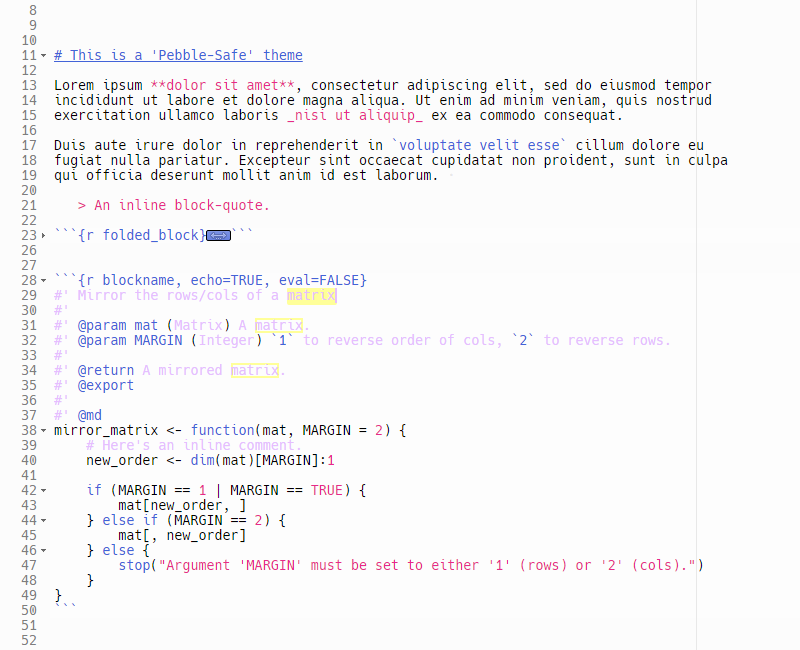
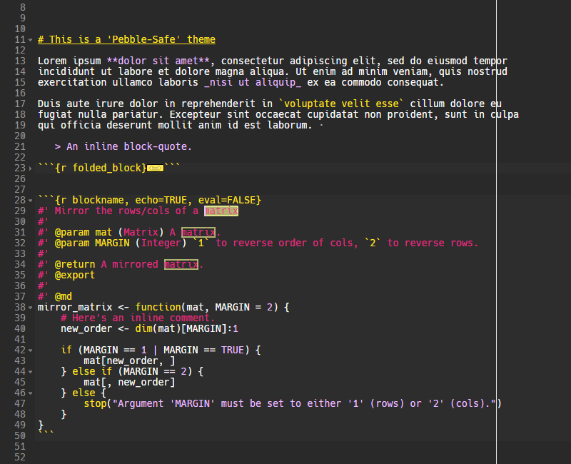
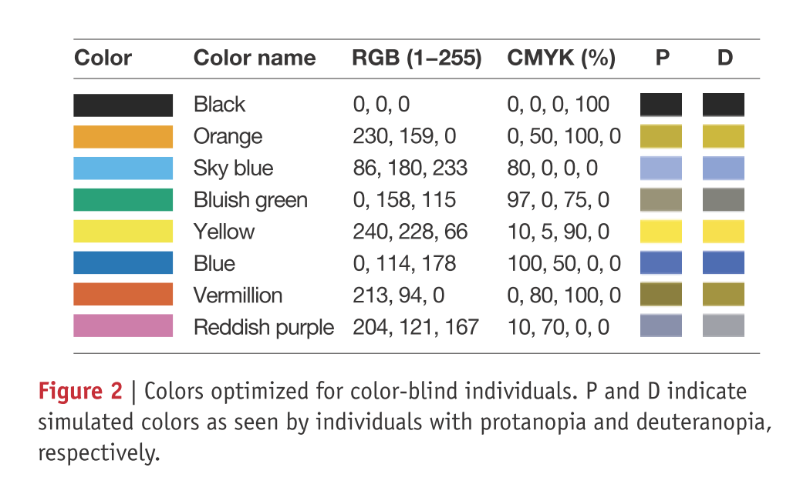
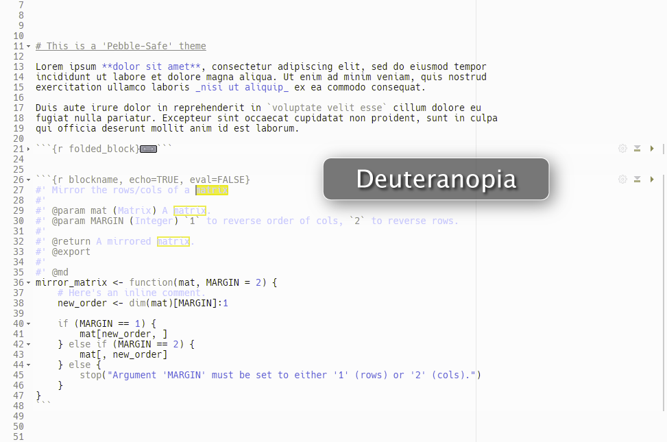
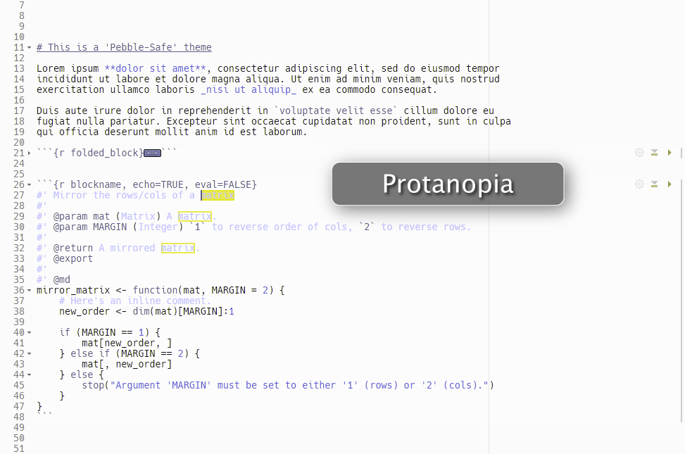
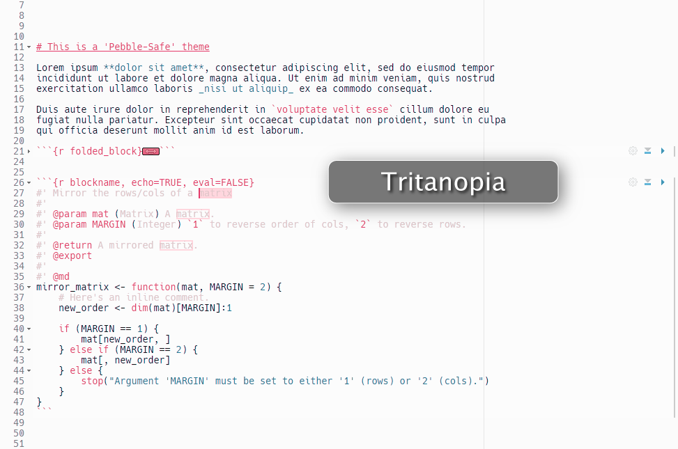
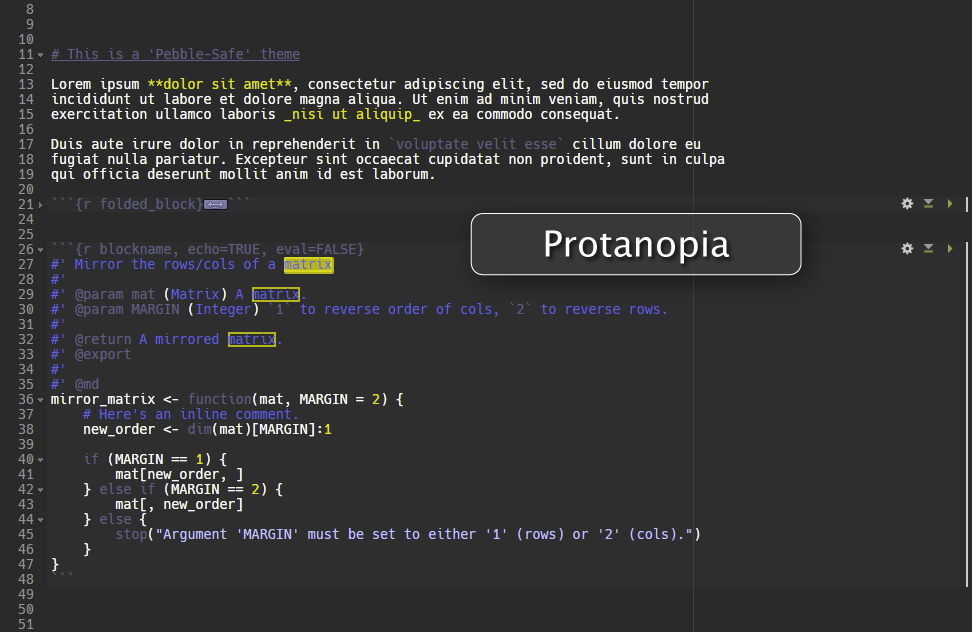
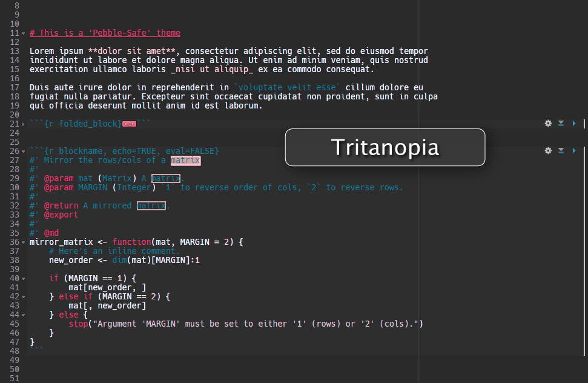

```{r setup, include=FALSE}
knitr::opts_chunk$set(echo = TRUE)

librarian::shelf(DesiQuintans/desiderata, RColorBrewer, tidyr, dplyr, 
                 stringdist)
```


## Preview

Pebble-Safe is a colourblind-friendly theme for RStudio 1.2.x. It comes in Light and Dark variants. The font used in the screenshots below is Hack in 10 pt <https://sourcefoundry.org/hack>.






## Installation

1. You need to be running RStudio v 1.2.x. At the time of writing (2019-02-19) this is only available as a Preview, and you can download the newest Preview here <https://www.rstudio.com/products/rstudio/download/preview/>.

2. Download one of the `.rstheme` files in the root of this repo.

3. In RStudio 1.2.x, go to _Tools_ → _Global Options_ → _Appearance_.

4. Click the _Add_ button underneath the list, choose your downloaded `.rstheme`, and click _Open_.

5. Click _Apply_ to apply the theme.


## Colourblind-friendly palettes

Choosing colours for syntax highlight has a few extra difficulties:

1. Text at normal sizes has thinner outlines that make subtle colours harder to differentiate.
2. Syntax highlighting is supposed to convey more information to the reader, and it's hard to convey lots of information with a smaller palette of styles and still have each type of information clearly distinct from the others.
3. The background of the text can affect the clarity of the colours. I personally find colours on a light background to be more bleached than colours on a dark background.

I found a few reliable sources for colourblind-friendly colour palettes.

The table of 8 colours below is from Wong (2011).

   > Wong, Bang. “Points of View: Color Blindness.” Nature Methods 8 (May 27, 2011): 441.  
   > https://doi.org/10.1038/nmeth.1618.



This table of qualitative colors is from the `RColorBrewer` package.

   > Erich Neuwirth (2014). RColorBrewer: ColorBrewer Palettes. R package version 1.1-2.  
   > https://CRAN.R-project.org/package=RColorBrewer

```{r}
display.brewer.all(type = "qual", colorblindFriendly = TRUE)
```

And this table of colours is from Sasha Trubetskoy.

   > Trubetskoy, Sasha. List of 20 Simple, Distinct Colors.
   > https://sashat.me/2017/01/11/list-of-20-simple-distinct-colors, accessed 2019-02-27.

```{r}
sasha_cols <- c("#FFE119", "#4363D8", "#F58231", "#FABEBE", "#E6BEFF", 
                "#800000", "#000075", "#A9A9A9", "#FFFFFF", "#000000")

show_colours(sasha_cols)
```


## Testing the colours

I've also added `#FCFCFC`, my preferred light background colour, just a whisker off pure white so it's a little easier on the eyes.

```{r}
raw_cols <- c("#666666", "#A6761D", "#E6AB02", "#66A61E", "#E7298A", "#7570B3", 
              "#D95F02", "#1B9E77", "#A6CEE3", "#1F78B4", "#B2DF8A", "#33A02C", 
              "#FB9A99", "#E31A1C", "#FDBF6F", "#FF7F00", "#CAB2D6", "#6A3D9A", 
              "#FFFF99", "#B15928", "#B3B3B3", "#E5C494", "#FFD92F", "#A6D854", 
              "#E78AC3", "#8DA0CB", "#FC8D62", "#66C2A5", "#CD7EAA", "#D5683A", 
              "#2A78B5", "#F1E54E", "#2AA179", "#62B6E6", "#E7A337", "#292929",
              "#FFE119", "#4363D8", "#F58231", "#FABEBE", "#E6BEFF", "#800000", 
              "#000075", "#FCFCFC", "#A9A9A9")

show_colours(raw_cols)
```

### Try to programmatically remove similar colours under red-green blindness

This is what the colour tiles above look like when deuteranopia (the most common kind of colourblindness) is simulated with Color Oracle <https://colororacle.org/>.

```{r}
deut_cols <- c("#666666", "#868614", "#BEBE00", "#969626", "#888886", "#7171B2", 
               "#909000", "#888879", "#C3C3E3", "#6767B5", "#D2D28B", "#8A8A34", 
               "#BDBD95", "#838300", "#D3D36C", "#B0B000", "#B9B9D5", "#4E4E99", 
               "#FEFE99", "#7B7B21", "#B2B2B2", "#CECE93", "#E4E42A", "#CACA57", 
               "#ABABC0", "#9A9ACB", "#B6B65D", "#ADADA6", "#9A9AA8", "#939331", 
               "#6868B5", "#E8E84E", "#8A8A7B", "#A2A2E6", "#B9B931", "#2A2A2A", 
               "#E9E914", "#5B5BD8", "#ADAD21", "#D1D1BC", "#CACAFE", "#4A4A00", 
               "#141475", "#FBFBFB", "#A8A8A8")

show_colours(deut_cols)
```

I can take these deuteranopia colours, convert them to RGB space, round their RGB scores to a common scale (e.g. round them to the nearest 10), and programmatically eliminate colours that are at the same RGB point.

```{r}
round_rgb <- function(hexcol, to = 1, dir = NULL) {
    col2rgb(hexcol) %>% 
        round_to_nearest(to = to, dir = dir) %>% 
        paste(collapse = " ")
}

cols <- 
    tibble(hex_col = raw_cols,
           hex_deut = deut_cols) %>% 
    rowwise() %>% 
    mutate_at(vars(starts_with("hex_")), 
              list(round = ~ round_rgb(., 10))) %>% 
    distinct(hex_deut_round, .keep_all = TRUE) %>% 
    distinct(hex_col_round, .keep_all = TRUE)

show_colours(cols$hex_col)
```

We eliminated 3 colours.

### Manually select colours under red-green brightness

```{r}
show_colours(cols$hex_deut)
```

I hand-picked all of the colours that I could easily differentiate. I made sure they were easy to differentiate them by dragging them beside each other in my colour picker (JCPicker <http://annystudio.com/software/colorpicker>) and squinting at their differences.

```{r echo=FALSE}
my_deut <- c("#E9E914", "#FEFE99", "#CACAFE", "#5B5BD8", "#2A2A2A", 
             "#888886", "#FBFBFB")

show_colours(sort(my_deut))
```

```{r echo=FALSE}
filter(cols, hex_deut %in% my_deut) %>% 
    arrange(hex_deut) %>% 
    use_series(hex_col) %>% 
    show_colours()
```


### Selected theme colours

So I guess these are my theme colours! These colours are okay under simulated deuteranopia, protanopia, and  tritanopia.

```{r echo=FALSE}
filter(cols, hex_deut %in% my_deut) %>% 
    arrange(hex_deut) %>% 
    use_series(hex_col)
```

```{r echo=FALSE}
filter(cols, hex_deut %in% my_deut) %>% 
    arrange(hex_deut) %>% 
    use_series(hex_col) %>% 
    show_colours()
```


## Designing the themes

(These are notes for the author and for any other theme authors who want to know the process. If you are a user, you only need to follow the [Installation instructions](#installation) above.)

It is often easier to visualise design changes by editing the stylesheet live in the inspector. Right-click on the RStudio editor pane and choose _Inspect Element_. In the left nav pane of the inspector, choose _theme/custom/local → your .rsTheme file_. You can edit the settings here but you cannot save the changes in the inspector.

### 1. Use a GUI editor to make a `.tmTheme`

I use <https://tmtheme-editor.herokuapp.com>. The RStudio theme backend has only some limited scopes, and the colourblind-friendly palette is so limited that I can't use all of them anyway.

These are the resources for designing a theme:

- <https://support.rstudio.com/hc/en-us/articles/115011846747-Using-RStudio-Themes>
- <https://rstudio.github.io/rstudio-extensions/rstudio-theme-creation.html>


### 2. Convert it to a `.rsTheme` in RStudio

```{r eval=FALSE}
rstudioapi::convertTheme("src/Pebble-safe Light.tmTheme")
rstudioapi::convertTheme("src/Pebble-safe Dark.tmTheme")
```


### 3. Edit the theme CSS by hand

Not much functionality is exposed via the editor theme scopes. These features need to be added by hand.

These edits are made inside the converted `.rstheme` files. For me, these files are located in `Documents\.R\rstudio\themes`.  I edit them in place and copy them to this repo to upload.

#### 3a. Fix heading style

Only the text colour of the markdown headings can be safely changed. Changing the background colour masks the selection box, and changing the text size makes the cursor no longer line-up with the text on that header line.

``` css
.ace_markup.ace_heading {
  text-decoration: underline;
  color: #E7298A;
}

.ace_heading {
  text-decoration: underline;
  color: #E7298A;

}
```

#### 3b. Fix selection box

The box has more padding around it and is a darker magenta than the cursor. The magenta makes search results easier to spot. `ace_selected-word` is the box that highlights search results that are not currently selected.

``` css
.ace_marker-layer .ace_selection {
  padding: 1px 0px 1px 2px;
  background: rgba(255, 225, 25, 0.75);
  
}

.ace_marker-layer .ace_selected-word {
  padding: 1px 0px 1px 2px;
  border: 2px solid rgba(255, 225, 25, 0.75);
}
```

#### 3c. Matching bracket indicator

Make it magenta to match the cursor.

``` css
.ace_bracket {
  margin: 0 !important;
  border: 0 !important;
  background-color: #E7298A;
}
```

#### 3d. Markdown block background

I made the background of the markdown blocks more similar to the normal background, and I added borders on the left and right sides of the block to delineate it.

I ideally would have liked to have a line at the top and bottom of the block, but the style is applied on a per-line basis and the block itself is not a single box element.

```
.ace_marker-layer .ace_foreign_line {
  position: absolute;
  z-index: -1;
  background-color: #fdfdfd; for light
  background-color: #2d2d2d; for dark
  border-right: 2px solid #cccccc;
  margin-right: 5px;
}
```

#### 3e. Column margin line

```
.ace_print-margin {
  width: 1px;
  background: #424242;
}
```

## Colourblind simulations of final themes

### Light theme








### Dark theme





